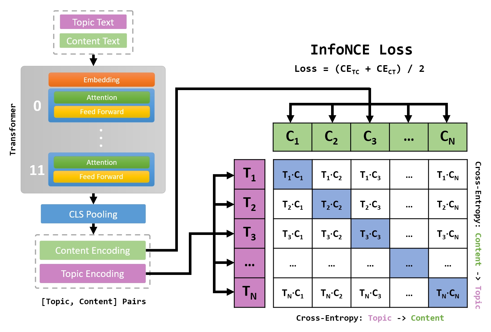
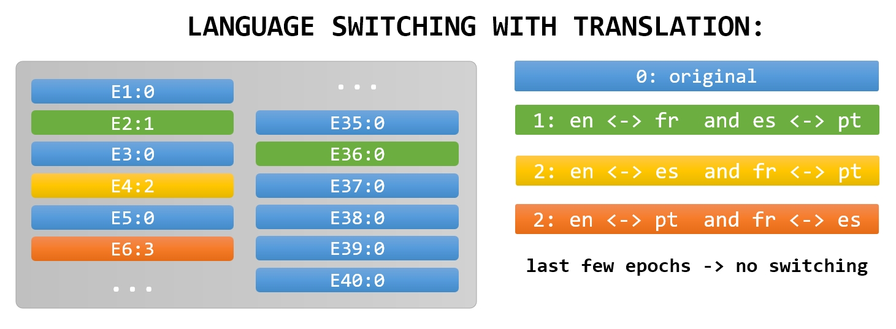
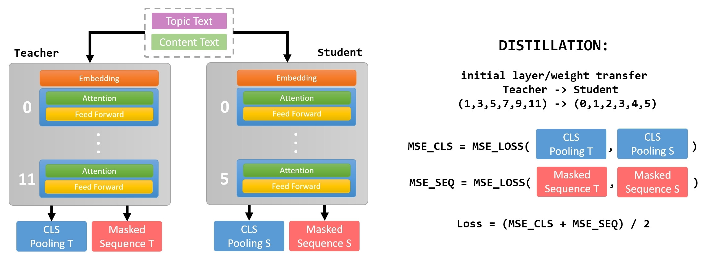
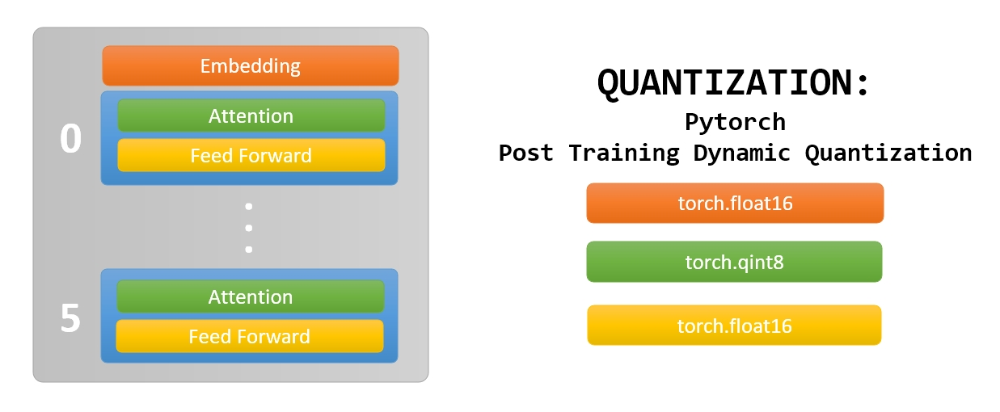
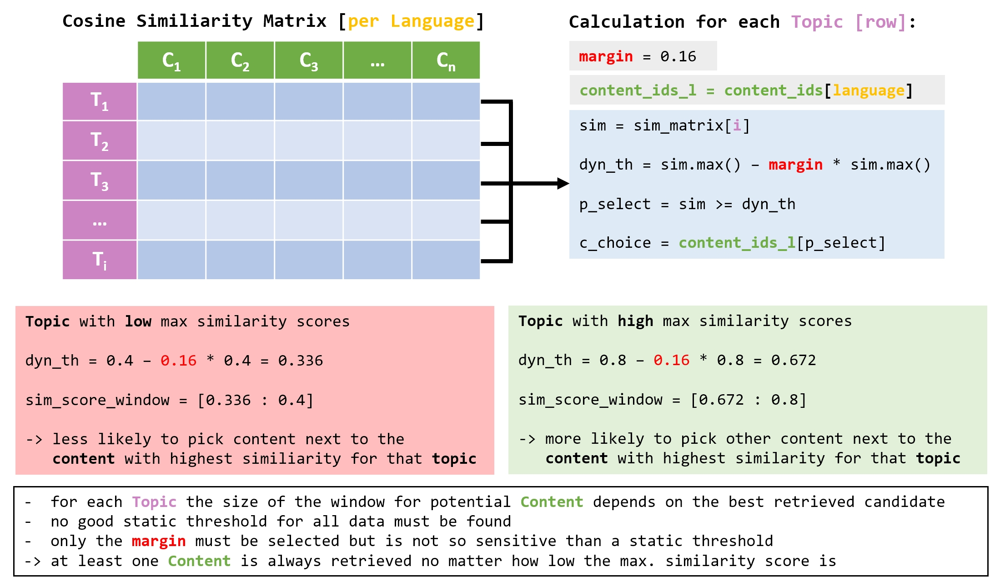

# learning_equality
[[Competition]](https://www.kaggle.com/competitions/learning-equality-curriculum-recommendations)
[[Write-Up]](https://www.kaggle.com/competitions/learning-equality-curriculum-recommendations/discussion/395110)
[[Inference: Leaderboard Prize]](https://www.kaggle.com/code/khabel/2nd-place-learning-equality-leaderboard-prize)
[[Inference: Efficiency Prize]](https://www.kaggle.com/code/khabel/2nd-place-learning-equality-efficiency-prize)


Training Code for 2nd Place Solution - Kaggle Challenge: **Learning Equality - Curriculum Recommendations**

## Approach



Single stage solution based on cosine-similarity between **Content** and **Topic** matching, trained with **InfoNCE** as training objective.


## Data

* Accept the challenge rules on kaggel to download the data for the [competition](https://www.kaggle.com/competitions/learning-equality-curriculum-recommendations) and place it in `./data/kaggle`
* Download the [translated data](https://www.kaggle.com/datasets/khabel/learning-equality-language-switch) for language switching and place it in `./data/switch`



You should have the following data structure:

```
learning_equality
├── data/
    ├── kaggle/
    │   ├── content.csv
    │   ├── correlations.csv
    │   ├── sample_submission.csv
    │   └── topics.csv
    └── switch/
        ├── content_1.csv
        ├── content_2.csv
        ├── content_3.csv
        ├── topics_1.csv
        ├── topics_2.csv
        └── topics_3.csv
```


Steps for data preparation:
1. create CV-Splits for offline evaluation: `cv_split.py`
2. data preparation and add folds to translated data: `data_preparation.py`


## Train

All settings are done by the **configuration dataclass** at the beginning of the script `train.py`.

When training on consumer-grade hardware like a single RTX 3090, set the following settings for comparable results:

```
batch_size: int = 512
gradient_checkpointing: bool = True
lr: float = 0.0002
lr_end: float = 0.00005 
```

It is not advisible to lower the batch\_size instead of using gradient check-pointing, because contrastive training with InfoNCE loss profits from a higher batch size for having enough hard negatives in the batch. 

For the final results in the competition, models trained on all data without any hold-out validation set were used. To train on **all data** change: 

```  
train_on_all: bool = True
```

If you want to train only on the original data without translation switching, set:

```  
pool = (0,) 
```

## Evaluate

Use `eval_gpu.py` for offline evaluation on trained fold and feature extraction for **topic** and **content**.

For **fold 0** pre-trained checkpoints are provided over the following [[Link]](https://drive.google.com/drive/folders/102N-wVRLhzf9d5IL3r1HFdYCsCZqcNQF?usp=share_link).
These checkpoints are trained on a single RTX 3090 for 40 Epoch using **margin = 0.16** during training. 

Unzip the checkpoints to:

```
learning_equality
├── checkpoints/
    ├── LaBSE/
    │   ├── config.py
    │   ├── log.txt	
    │   └── weights_fold_0.pth
    └── paraphrase-multilingual-mpnet-base-v2/
        ├── config.py
        ├── log.txt
        └── weights_fold_0.pth
```

To evaluate an ensemble of more models use `eval_ensemble.py` to evalute on the **extracted features**.

Results with **margin = 0.16**:

```  
Model:                                                      | Fold 0 | Public | Privat 
---------------------------------------------------------------------------------------
sentence-transformers/LaBSE                                 | 0.6660 | 0.6637 | 0.7026
sentence-transformers/paraphrase-multilingual-mpnet-base-v2 | 0.6615 | 0.6618 | 0.7092
---------------------------------------------------------------------------------------
Ensemble:                                                   | 0.6849 | 0.6808 | 0.7238
```

Results per language for the ensemble:

```
------------------------------[Ensemble]------------------------------
en  Score: 0.68640 - Precision: 0.65308 - Recall: 0.742 - Selected:   5 - (2806x65939)
es  Score: 0.76713 - Precision: 0.71482 - Recall: 0.835 - Selected:   4 - (1177x30844)
pt  Score: 0.79943 - Precision: 0.74148 - Recall: 0.860 - Selected:   6 - (343x10435)
ar  Score: 0.54267 - Precision: 0.56559 - Recall: 0.662 - Selected:   4 - (318x7418)
fr  Score: 0.61698 - Precision: 0.64399 - Recall: 0.662 - Selected:   7 - (304x10682)
bg  Score: 0.70410 - Precision: 0.67926 - Recall: 0.756 - Selected:   7 - (242x6050)
bn  Score: 0.17561 - Precision: 0.11966 - Recall: 0.230 - Selected:   7 - (237x2513)
sw  Score: 0.71674 - Precision: 0.65091 - Recall: 0.789 - Selected:   5 - (209x1447)
gu  Score: 0.77115 - Precision: 0.68613 - Recall: 0.839 - Selected:   5 - (181x3677)
hi  Score: 0.71008 - Precision: 0.68468 - Recall: 0.774 - Selected:   7 - (138x4042)
it  Score: 0.87877 - Precision: 0.88017 - Recall: 0.904 - Selected:   4 - (73x1300)
zh  Score: 0.66702 - Precision: 0.59670 - Recall: 0.758 - Selected:   9 - (68x3849)
mr  Score: 0.72963 - Precision: 0.69001 - Recall: 0.798 - Selected:  11 - (24x999)
fil Score: 0.80584 - Precision: 0.69457 - Recall: 0.882 - Selected:   7 - (23x516)
as  Score: 0.45620 - Precision: 0.31313 - Recall: 0.662 - Selected:   7 - (13x641)
my  Score: 0.76245 - Precision: 0.82500 - Recall: 0.829 - Selected:   3 - (12x206)
km  Score: 0.95030 - Precision: 0.94697 - Recall: 0.958 - Selected:   4 - (11x505)
kn  Score: 0.63193 - Precision: 0.52910 - Recall: 0.744 - Selected:  10 - (9x501)
te  Score: 0.77938 - Precision: 0.54730 - Recall: 0.946 - Selected:  16 - (7x285)
or  Score: 0.72903 - Precision: 0.71429 - Recall: 0.733 - Selected:   8 - (5x326)
ta  Score: 0.68842 - Precision: 0.45114 - Recall: 1.000 - Selected:   9 - (5x216)
ur  Score: 0.35907 - Precision: 0.22956 - Recall: 0.448 - Selected:   9 - (5x245)
pnb Score: 0.89423 - Precision: 0.82500 - Recall: 0.938 - Selected:   9 - (4x184)
ru  Score: 0.70697 - Precision: 0.67778 - Recall: 0.767 - Selected:  11 - (3x188)
pl  Score: 0.66623 - Precision: 1.00000 - Recall: 0.632 - Selected:  28 - (3x319)
swa Score: 0.16744 - Precision: 0.11597 - Recall: 0.320 - Selected:  40 - (3x495)
tr  Score: 0.71442 - Precision: 0.87698 - Recall: 0.696 - Selected:  23 - (3x225)
--------------------------------------------------------------------------------
Eval Score: 0.68489 - Precision: 0.64888 - Recall: 0.748
--------------------------------------------------------------------------------
```

When training with only one fold, 1/10 of the training data is missing, and since the content of this data may also be included in the test set, it is highly advisable to create an ensemble with multiple folds or to train with all training data without any validation hold-out.

For the competition results the checkpoints trained on all training data without evaluation hold-out are provided via Kaggle in the inference notebooks.
[[Inference: Leaderboard Prize Models]](https://www.kaggle.com/code/khabel/2nd-place-learning-equality-leaderboard-prize/input)
[[Inference: Efficiency Prize Models]](https://www.kaggle.com/code/khabel/2nd-place-learning-equality-efficiency-prize/input)


## Distillation (Efficiency Prize)



For distillation also use `train.py` and change:

```
transformer_teacher: str = <name of the trained teacher model>
use_teacher: bool = True         
pooling_teacher: str = <pooling used for teacher>

layers_to_keep = (0,2,4,7,9,11) # just an example

checkpoint_start = None or <teacher checkpoint>
checkpoint_teacher = <teacher checkpoint>

```

### Evaluate 

A checkpoint for a distilled **LaBSE** model trained on **Fold 0** using a singel RTX 3090 for 40 Epochs with **margin = 0.16** during training, is provided over the following [[Link]](https://drive.google.com/drive/folders/102N-wVRLhzf9d5IL3r1HFdYCsCZqcNQF?usp=share_link).

Teacher and inital weights of the remaining layers come from the also provided **LaBSE** model with **F2-Score = 0.6660**


Place the downloaded checkpoint under:

```
learning_equality
└── checkpoints_distilled/
    └── LaBSE/
        ├── config.py
        ├── log.txt	
        └── weights_fold_0.pth
```

and use `eval_gpu.py` by setting `num_hidden_layers = 6` to change the initial transformer config to only **6 layers**.

Results with **margin = 0.16**:

``` 
Model:                                                      | Fold 0 | Public | Privat 
---------------------------------------------------------------------------------------
sentence-transformers/LaBSE (distilled)                     | 0.6631 | 0.6523 | 0.6907
---------------------------------------------------------------------------------------
```


## Quantization (Efficiency Prize)



To save a quantized jit traced model and do feature extraction for **topic** and **content** use `eval_cpu.py`.

Results with **margin = 0.16**:

``` 
Model:                                                      | Fold 0 | Public | Privat
---------------------------------------------------------------------------------------
sentence-transformers/LaBSE (distilled + quantized)         | 0.6609 | 0.6526 | 0.6895
---------------------------------------------------------------------------------------             
```


## Dynamic Threshold

For evaluation and inference a dynamic threshold is used:




A higher margin leads to higher recall and slightly better F2-Score. For the final solution a **margin = 0.18** was used in the inference notebook.


## Inference Notebooks on Kaggle

Inference Notebooks and checkpoints are available on Kaggle:
* [[Inference: Leaderboard Prize]](https://www.kaggle.com/code/khabel/2nd-place-learning-equality-leaderboard-prize)
* [[Inference: Efficiency Prize]](https://www.kaggle.com/code/khabel/2nd-place-learning-equality-efficiency-prize)

## Write-Up

For some more informations:
* [[Write-Up]](https://www.kaggle.com/competitions/learning-equality-curriculum-recommendations/discussion/395110)